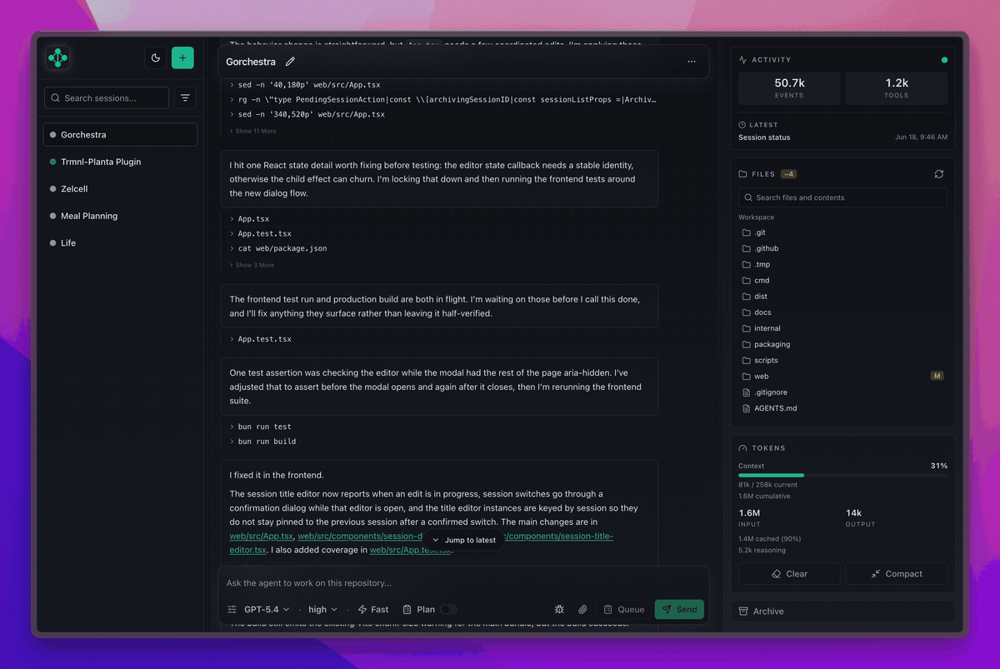
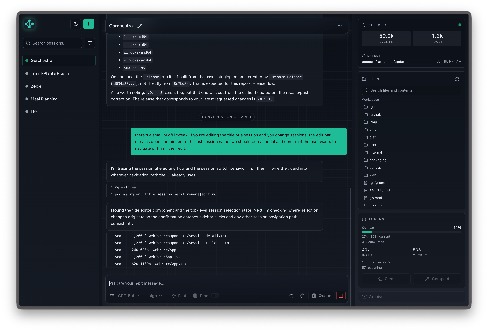
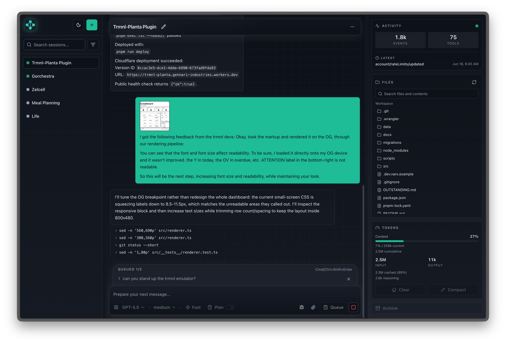

# Gorchestra

<p align="center">
  <strong>The private, permanent control room for AI coding work.</strong>
</p>

<p align="center">
  Run multiple Codex and Claude sessions, stream every event, inspect files and git state, and keep the whole story.
</p>

<p align="center">
  
  
  
  
  
</p>

> Agents perform work. Gorchestra conducts the performance.

Take your development wherever you are. Gorchestra gives you a private, permanent control room for AI coding work: open it on desktop or mobile, run multiple sessions across agents, queue follow-up messages, upload screenshots, switch into planning mode, inspect files and git state, and come back to the same durable history after refreshes, reconnects, and restarts.

<p align="center">
  
</p>

## The Runtime At A Glance

| Run | Coordinate | Inspect | Remember |
| --- | --- | --- | --- |
| Launch Codex or Claude sessions from one local server. | Queue work, attach images, and switch between fast and planning flows. | Browse files, inspect git-aware changes, and edit text in-session. | Store ordered session history in SQLite. |
| Tune model, reasoning, service tier, and execution mode. | Keep multiple sessions moving at once from desktop or mobile. | Jump from file-change diffs straight into Monaco. | Reconnect with replay instead of losing context. |

## Why It Exists

Coding agents are useful, but serious work falls apart when everything is trapped in a single chat window. Gorchestra turns each run into an operating surface: start a session, watch what the agent is doing, inspect file and git changes, queue the next step, and keep the full history after refreshes or restarts.

It is built for getting work done locally:

- Pick a workspace and start Codex or Claude.
- Watch messages, thinking, tool calls, logs, errors, and file edits as they happen.
- Queue follow-up prompts while the current run is still working.
- Open changed files, review diffs, inspect git state, and edit Markdown or text without leaving the app.
- Come back later and see the same ordered session history.

<p align="center">
  
</p>

## Quick Tour

Start a session, choose a workspace, and let the agent run. Gorchestra keeps the live transcript, workspace tools, and session controls together so you do not have to bounce between terminal tabs, editor windows, and logs.

- Tune Codex options like model, reasoning effort, service tier, planning mode, and dangerous mode.
- Follow messages, thinking, tool calls, command output, file edits, errors, and debug events in one transcript.
- Keep typing while a run is active, queue messages, attach images, and answer agent-requested prompts when a run needs input.
- Browse, search, preview, and edit workspace files from the side rail.
- Review file-change diffs and jump straight into the editor for the changed file.
- Refresh or reconnect without losing the session history.

<p align="center">
  
</p>

## Install

Gorchestra is meant to run as one local binary with the React UI embedded inside it.

### Homebrew

```sh
brew install jgennari/tap/gorchestra
gorchestra --open
```

The published tap is `jgennari/homebrew-tap`; the formula builds Gorchestra from the tagged source archive with Go and installs the `gorchestra` binary.

Run Gorchestra as a background service:

```sh
brew services start jgennari/tap/gorchestra
open http://127.0.0.1:15173
brew services stop jgennari/tap/gorchestra
```

The Homebrew service reads `$(brew --prefix)/etc/gorchestra/gorchestra.env`. Edit that file and restart the service to change the port, data directory, workspace roots, or Codex binary path.

### Direct Download

Download the archive for your platform from GitHub Releases, unpack it, and run the binary.

macOS and Linux:

```sh
tar -xzf gorchestra_<version>_<os>_<arch>.tar.gz
./gorchestra --open
```

Windows:

```powershell
Expand-Archive .\gorchestra_<version>_windows_<arch>.zip -DestinationPath .\gorchestra
.\gorchestra\gorchestra.exe --open
```

Release targets:

- `darwin/arm64`
- `darwin/amd64`
- `linux/amd64`
- `linux/arm64`
- `windows/amd64`
- `windows/arm64`

Real Codex sessions require the Codex CLI to be available on `PATH`, or configured with `--codex-bin`.

## Use

Start Gorchestra and open the browser:

```sh
gorchestra --open
```

By default, Gorchestra binds to `127.0.0.1:8080` and stores SQLite data in the OS app data location.

Common options:

```sh
gorchestra --host 127.0.0.1 --port 8081
gorchestra --config ~/.config/gorchestra/gorchestra.env
gorchestra --data-dir ~/.gorchestra-dev
gorchestra --workspace /path/to/repo
gorchestra --workspace-root /path/to/allowed/root
gorchestra --codex-bin /path/to/codex
gorchestra --codex-model gpt-5
gorchestra --codex-sandbox workspace-write
gorchestra --codex-network-access=false
gorchestra --codex-web-search=cached
gorchestra --version
```

`--data-dir` creates the directory if needed and stores SQLite at `<data-dir>/gorchestra.db`. `--db` is still available as an exact SQLite path override and takes precedence over `--data-dir`.

Default data paths:

```txt
macOS: ~/Library/Application Support/Gorchestra/gorchestra.db
Linux: $XDG_DATA_HOME/gorchestra/gorchestra.db
Linux fallback: ~/.local/share/gorchestra/gorchestra.db
```

Environment equivalents include `GORCHESTRA_HOST`, `GORCHESTRA_PORT`, `GORCHESTRA_DATA_DIR`, `GORCHESTRA_DB`, `GORCHESTRA_WORKSPACE`, `GORCHESTRA_OPEN`, and the `GORCHESTRA_CODEX_*` variables matching the Codex flags.

Config files use the same env-style names:

```txt
GORCHESTRA_HOST=127.0.0.1
GORCHESTRA_PORT=15173
GORCHESTRA_DATA_DIR=/opt/homebrew/var/gorchestra
GORCHESTRA_WORKSPACE=~
GORCHESTRA_WORKSPACE_ROOTS=~
GORCHESTRA_OPEN=false
GORCHESTRA_CODEX_BIN=codex
```

`GORCHESTRA_CONFIG` is the environment equivalent of `--config`. `GORCHESTRA_WORKSPACE_ROOTS` accepts multiple paths separated by the OS path-list separator (`:` on macOS/Linux).

Remove local app data:

```sh
rm -rf "$HOME/Library/Application Support/Gorchestra"
rm -rf "${XDG_DATA_HOME:-$HOME/.local/share}/gorchestra"
```

Codex shell commands run with network access enabled by default. Codex native web search runs in live mode by default; use `--codex-web-search=cached` or `--codex-web-search=disabled` to change it.

## Build From Source

Prerequisites:

- Go 1.23 or newer
- Bun 1.3 or newer

Build the release binary with embedded frontend assets:

```sh
bun run build
```

This installs frontend dependencies with Bun, builds the Vite app, stages `web/dist` into `internal/webassets/dist`, runs `go test ./...`, builds `dist/gorchestra`, and writes `dist/SHA256SUMS`.

Run the source-built binary:

```sh
./dist/gorchestra --open
```

Staged assets under `internal/webassets/dist` are committed so `go test ./...` and `go build ./cmd/app` work from a checkout. `bun run build` refreshes that directory from the latest Vite output before compiling the release binary.

## Tests

Backend:

```sh
go test ./...
```

Frontend:

```sh
cd web
bun run test
bun run build
```

Production:

```sh
bun run build
./dist/gorchestra --version
```

`dist/SHA256SUMS` contains SHA-256 checksums for local release artifacts.
