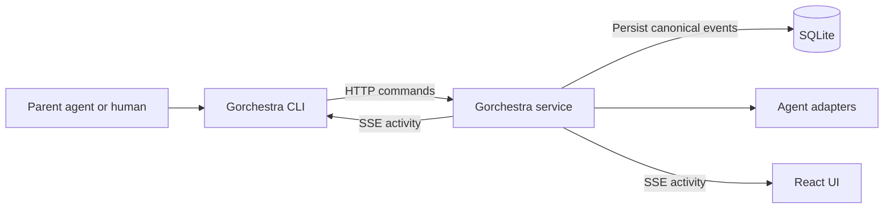

# Agent control CLI and child sessions

Status: Stages 1-3 implemented; Stage 4 pending

Date: 2026-09-17

The goal is to let any agent use Gorchestra to create work, delegate it to child
sessions, observe progress, and retrieve a completed report through a CLI.
The first version uses explicit wait/fetch. Automatic report delivery and waking
an idle parent are deferred, as agreed with Joey.

## Recommended architecture

Extend the existing `gorchestra` Go binary. Add a client command dispatcher before
server initialization and an explicit `serve` command. Running `gorchestra`
without arguments prints offline command discovery; installed services invoke
`gorchestra serve` explicitly. Keep `host` commands working. Help and command
discovery must work without a running server. Continue accepting legacy
top-level server flags during the transition so an upgraded binary does not
break an already-loaded development supervisor or Homebrew service plist.

The CLI calls the running HTTP service. Only the service owns the database,
adapter processes, session lifecycle, and persisted events. Client commands never
open SQLite or initialize another backend. Connection failure returns an error
with the selected server address; it does not silently start a server.



Keep client transport and rendering separate from server orchestration so a
smaller client-only binary or another interface can reuse them later. A second
distributed binary is unnecessary for the first release.

## Existing building blocks and gaps

Source review found:

- `cmd/app/main.go` dispatches `gorchestra host` before starting the server;
  `cmd/app/host_cli.go` already implements an HTTP client command family.
- `internal/httpapi/sessions.go` implements create, submit, queue, steer, cancel,
  settings, and run execution. It already supplies `GORCHESTRA_SESSION_ID`,
  `GORCHESTRA_RUN_ID`, `GORCHESTRA_API_URL`, and `GORCHESTRA_BIN` to adapters.
- Provider options already include model, reasoning/effort/thinking, fast mode,
  and planning where supported. `GET /api/agents/{agentType}/options` supplies
  model and mode discovery. Capability validation needs a common CLI contract.
- Runs already have IDs in canonical events and a persisted `dashboard_runs`
  projection. Message submission responses currently omit the run ID.
- Sessions have `idle`, `running`, and `failed` status. Successful and cancelled
  runs both return the session to idle. Waiting on session status alone cannot
  identify the result of a particular invocation.
- Canonical messages and tool completions are persisted; `.delta` events are
  transient. History and SSE use bounded payload projections with separate
  endpoints for full tool output. Raw provider debug events have retention limits.
- Message submissions have durable deduplication, but creating a new session and
  submitting its first prompt are separate operations today.
- There is no persisted session parent relationship. The sidebar renders a flat
  session list. Dashboard delegation outcomes are not child-session ownership.

## CLI contract

The table describes the intended complete surface. Stage 1 implements command
discovery, agent discovery/options, detached `run`, `runs show`, and
`runs report`. Later rows remain planned.

| Command | Purpose |
| --- | --- |
| `gorchestra commands --json` | List every implemented command, flags, constraints, workflows, output behavior, runtime environment, and exit codes. |
| `gorchestra help [command...]` | Human-readable discovery, including existing hosting commands. |
| `gorchestra agents list --json` | Discover registered providers and availability. |
| `gorchestra agents options <provider> --json` | Discover models, supported thinking levels, fast mode, and plan mode. |
| `gorchestra run ...` | Create a session and start its first run; optionally attach it to a parent. |
| `gorchestra sessions list --json` | List/filter sessions, including parent relationships and pagination. |
| `gorchestra sessions show <session-id> --json` | Inspect settings, workspace, active run, and attention state. |
| `gorchestra sessions children <session-id> --json` | Discover children, with an optional recursive view. |
| `gorchestra sessions send <session-id> ...` | Start a follow-up run; queue or steer only with explicit flags. |
| `gorchestra sessions settings <session-id> ...` | Inspect/change settings for subsequent runs. |
| `gorchestra sessions archive/restore <session-id>` | Manage session visibility without destroying lineage. |
| `gorchestra runs show <run-id> --json` | Read the exact run's current state and resolved options. |
| `gorchestra runs watch <run-id> ...` | Replay and follow that run's activity until terminal. |
| `gorchestra runs wait <run-id>... --any/--all` | Wait for one or several known runs without printing activity. |
| `gorchestra runs report <run-id> --json` | Retrieve the durable result, including failure or cancellation. |
| `gorchestra runs cancel <run-id>` | Cancel only the specified run, without cancelling a newer run by accident. |
| `gorchestra requests list/answer/resolve ...` | Inspect questions and permission requests and explicitly respond. |

Generate help and the machine-readable command manifest from one registry so
discovery does not drift. Include schema/protocol versions and capabilities in
service discovery; an older service must produce a clear unsupported-feature
error. Do not advertise unimplemented commands.

Common execution options:

- `--agent`, `--model`, `--thinking`, `--fast=true|false`, `--plan=true|false`.
- `--cwd`, `--parent <session-id|current|none>`, `--title`.
- `--prompt <text>` or `--prompt-file <path|->`; `-` reads stdin. Structured
  requests can use `--input-json <path|->` rather than shell-escaped JSON.
- `--detach`, `--format text|json|ndjson`, `--timeout`, `--request-id`.
  `--json` is shorthand for `--format json`.
- `--server` overrides `GORCHESTRA_API_URL`, then client configuration/defaults.
  A remote workspace path refers to the server filesystem; require an explicit
  workspace or parent for remote creation rather than sending a local cwd blindly.

Examples for an agent running inside Gorchestra:

```sh
# Discover syntax and actual provider/model capabilities.
"$GORCHESTRA_BIN" commands --json
"$GORCHESTRA_BIN" agents options codex --json

# Stream a new child and exit when its first run finishes.
"$GORCHESTRA_BIN" run --parent current --agent codex \
  --thinking high --fast=true --plan=true \
  --prompt-file task.md --format ndjson

# Return a receipt immediately; execution remains owned by the service.
"$GORCHESTRA_BIN" run --parent current --agent codex \
  --prompt-file task.md --detach --format json

# Use the run_id from the receipt to monitor or retrieve the result.
"$GORCHESTRA_BIN" runs watch run_example --format ndjson
"$GORCHESTRA_BIN" runs wait run_example --timeout 10m --format json
"$GORCHESTRA_BIN" runs report run_example --json
```

An explicit `--model` overrides the inherited/default model. The example model is
left unspecified because the agent should discover actual installed capabilities.

### Managed-run bootstrap

The HTTP orchestration layer adds run-scoped environment variables to every real
provider process:

- `GORCHESTRA_BIN`: the absolute path to the running Gorchestra executable.
- `GORCHESTRA_API_URL`: the API URL that executable should target.
- `GORCHESTRA_SESSION_ID`: the current session, used as the default child parent.
- `GORCHESTRA_RUN_ID`: the exact current run, recorded as the child's spawning run.

For normal message runs, it also prefixes the provider prompt with this text:

```xml
<gorchestra_context>
This session is running inside Gorchestra, an agent orchestration service that coordinates multiple concurrent agents across supported providers.
You can use Gorchestra's CLI to delegate independent work to child agents and monitor their exact runs.
Use "$GORCHESTRA_BIN" commands --json to discover the current CLI contract.
Use "$GORCHESTRA_BIN" run --prompt-file <path> to delegate work to a child session. Inside a run, children inherit this session's provider, resolved options, and workspace unless you explicitly override supported provider settings. Use --detach to receive IDs immediately, runs wait or runs watch to observe exact runs, and runs report to retrieve durable results. Child sessions share this workspace, so assign disjoint edits when delegating parallel work.
</gorchestra_context>
```

The original user message follows after a blank line and remains separately
persisted for the UI. Codex, Claude, OpenCode, and Pi all use the same
`AgentInput.ProviderMessage()` wrapper. The deterministic fake test adapter does
not invoke an external harness and intentionally reads the original message.

When `.gorchestra/host.yaml` exists in the session workspace, the context also
includes:

```text
This workspace has a Gorchestra hosted-preview recipe at .gorchestra/host.yaml.
Use "$GORCHESTRA_BIN" host validate|status|start|stop|restart|check|logs|url to manage this session's preview. The CLI targets this session automatically through GORCHESTRA_SESSION_ID and GORCHESTRA_API_URL.
```

### Foreground, detached, and background behavior

- `run` defaults to streaming until its first run completes, fails, or is
  cancelled, then exits with a corresponding code. `--format json` waits quietly
  and returns one result; `ndjson` streams records; `text` is readable in a terminal.
- `run --detach` returns a receipt with `session_id`, `run_id`, request ID, resolved
  settings, workspace, parent, and UI link after durable acceptance. Detached
  runs remain inspectable after the creating CLI process exits.
- A shell can background `run` or `runs watch`; that observer exits at completion.
  This covers a background process that finishes with its task. A per-task daemon
  and standalone execution engine are outside the initial scope.
- Ctrl-C, client timeout, or a closed output pipe stops observation. It leaves
  server work running. Use `runs cancel` to stop execution explicitly. State this
  in help and return resumable identifiers/cursors when possible.
- Server restart recovery settles interrupted runs visibly under the existing
  policy; it does not automatically restart their provider work.

### Output and stream semantics

In machine formats stdout contains only valid JSON/NDJSON. Human diagnostics go
to stderr. No ANSI output without a TTY. Every streaming record has a schema
version and a discriminant such as `accepted`, `event`, `snapshot`, `result`, or
`error`; event records preserve session ID, run ID, event ID, sequence, type,
timestamp, transient flag, and payload. Flush each record promptly.

Stream assistant text, provider-exposed thinking/plan updates, tool starts,
arguments, tool output, file changes, input requests, errors, and terminal results.
Default to normalized events; raw provider debug records are opt-in. Preserve
truncation markers and full-content references. Offer explicit full-output
retrieval for stored tool results; never present a shortened preview as complete.

Replay durable history in pages, then follow SSE with duplicate suppression and
the existing subscribe/replay handoff. Handle `stream.resync.required` by paging
missing canonical history and obtaining a live snapshot before continuing.
Maintain durable resume progress separately from transient delivery progress;
sequence numbers may have gaps. Completed records replace accumulated deltas in
the text renderer. NDJSON consumers receive both event kinds explicitly.

Exact historical delta timing/chunk boundaries are not promised. A reconnect
recovers canonical completed content and available live state. A broken connection
returns a structured error and cursor for explicit reattachment; do not add
automatic command or stream retries in the first version.

Use stable, documented exit codes: `0` success/accepted/query success, `1` remote
run failure, `2` usage/validation, `3` service/transport failure, `4` wait timeout,
`5` run cancellation, `6` needs input when `--until-attention` is requested, and
`130` local interruption. For `wait --any`, report the selected run; for `--all`,
return all results and fail if any failed or was cancelled. Report/show commands
return query success even when the inspected run failed; the outcome is data.

## Parent-child behavior

A child is an ordinary Gorchestra session with immutable `parent_session_id` and,
when created by an active run, `spawned_by_run_id`. Persist the relationship and
creation event together before execution. Index parent lookup. Record delegation
events linking both sessions/runs so the parent history and dashboard can explain
what it spawned; keep detailed tool activity in the child's stream.

- Inside an agent runtime, `run` defaults to the current session as parent.
  `--parent current` is explicit equivalent syntax. `--parent none` creates a
  root. Outside Gorchestra, new sessions default to roots.
- Children use the parent's resolved directory at creation. No worktree is
  created. Conflicting `--cwd` is rejected in shared-directory child mode.
  Later parent workspace changes do not silently relocate existing children.
- Each child starts a fresh provider conversation with its task prompt and normal
  repository/runtime instructions. No implicit transcript copying or provider
  conversation forking. Context inheritance can be a later explicit feature.
- Default to the parent's provider. Within that provider, resolve options from
  explicit overrides, the spawning run's option snapshot when available, parent
  session defaults, then provider defaults. With a different provider, use its
  own defaults and explicitly supplied supported options. Persist the resolution.
- Boolean overrides must distinguish omitted from false. Unsupported requested
  settings fail before acceptance; fast/plan support is not assumed across
  providers. Child permission settings follow the existing configured policy;
  mode flags must not silently broaden them.
- Parentage expresses lineage, not process lifetime. Parent completion, observer
  exit, or parent cancellation does not silently cancel children. Expose explicit
  subtree cancellation through `sessions cancel <session-id> --tree`, and show
  active descendants even when the parent is idle. A tree cancellation snapshots
  its target run IDs and blocks new descendants during cancellation so it cannot
  miss a concurrent spawn or accidentally cancel an unrelated later run.
- Children can spawn children. Validate parents, prevent cycles, and apply
  configurable depth/concurrency bounds. Initially reject excess work visibly
  rather than add a hidden scheduler. Waiting parents must not exhaust all
  capacity available for their children.
- Same-directory agents see each other's writes. V1 supports this intentionally;
  the delegating prompt should assign disjoint edits where parallel work overlaps.
  Worktree isolation and merging can be separate later features.

For UI, render expandable parent rows with indented descendants, parent links,
and aggregate running/attention counts. Preserve ordinary child detail pages and
deep links. Cap visual indentation on mobile without flattening lineage.
Search, filters, and pagination must retain ancestor context or show it explicitly
for matching children; a child outside the latest 50 sessions must not disappear.
Use root pagination with lazy child loading/counts. Archiving a parent changes
only that session by default; unarchived children remain reachable beneath an
archived ancestor placeholder. Never implicitly archive an active subtree.

## Durable submission and reports

Expose a server-owned create-and-start operation, for example `POST /api/runs`,
which accepts the task, optional parent, provider/settings, and client request ID.
Return the accepted session and run IDs. Existing-session submission also returns
an exact run ID, or a durable queue-item/submission handle if queued; callers can
resolve that handle to the eventual run. The CLI rejects busy-session sends
unless `--queue` or `--steer` is selected explicitly.

Atomically persist request-ID binding, child/session creation, linkage, initial
prompt, and accepted run intent before launching the provider. Provider process
startup happens after commit. Reusing an ID with identical input returns the same
receipt; different input is a conflict. A crash between acceptance and launch is
reconciled to a visible interrupted/not-started result, never a duplicate launch.
This extends the existing submission-deduplication approach without introducing
automatic retries or claiming an atomic transaction with an external process.

Add run read/report endpoints and cancellation with exact run identity. Reuse or
generalize the existing event-derived run projection, keeping events canonical.
Refactor only the lifecycle code needed from HTTP handlers into orchestration so
browser, CLI, and scheduler calls share the same behavior.

A report is a deterministic projection of one run, available after restart:

- Run/session/parent IDs, provider, requested and resolved options, workspace,
  status, start/end times, and start/terminal event sequence.
- Full final assistant response, or an explicit indication that none was emitted.
  Prefer normalized final-message metadata where supported; otherwise identify
  the last completed assistant message and label that fallback. Keep final output
  separate from partial messages on failed runs. The dashboard's abbreviated
  summary is insufficient for this contract.
- Errors/cancellation reason, pending questions/permissions, tool counts, recorded
  file changes, and token/cost usage only where actually reported.
- Recorded tests, commits, PRs, artifacts, and child-run references where present.
  Missing evidence is unknown, not a claim that tests passed or no files changed.

Reports do not need another LLM call. Child prompts can request a useful handoff
format such as outcome, files changed, validation, and unresolved work; the raw
final response remains available. A structured JSON handoff is optional later.

Question/permission events are surfaced immediately. Waiting continues by default;
`--until-attention` returns the request details and a distinct code so a parent
can act. Expose explicit answer/resolve commands through existing brokers without
inventing answers or automatically approving requests. The browser remains usable
for human intervention. Child completion does not inject a parent message in V1.

## Implementation stages and acceptance gates

1. **Run API and CLI foundation — complete.** Introduce dispatch/client packages, offline
   help/manifest, capability discovery, exact run receipts, durable create/start,
   run inspection, and report projection. Preserve current server and host usage.
   Demonstrate detached creation and an unambiguous report after completion.
2. **Observation and control — complete.** Add text/JSON/NDJSON renderers, paginated history,
   SSE follow/resync, wait-any/all, exact cancellation, follow-up/queue/steer, and
   question handling. Demonstrate a process streaming tools and output, exiting
   on its own run's terminal event, and later reconstructing the same result.
3. **Delegation and UI — complete.** Add lineage migration and transactional linkage, shared
   workspace/option inheritance, runtime instructions, bounds, delegation events,
   and the expandable session tree. Demonstrate one parent creating two children,
   fetching both reports, and all three sessions remaining inspectable in the UI.
4. **Release verification.** Exercise isolated fake-provider integration tests,
   adapter option boundaries, and a bounded real-provider smoke run when authorized
   for implementation. Update CLI documentation and distribution smoke tests.

Stage 1 verification on 2026-09-17 covered the complete Go test suite, `go vet`,
an isolated compiled-binary service, offline command discovery, provider discovery,
detached fake-agent creation, terminal report retrieval, and an idempotent retry
that returned the original session and run IDs.

Stage 2 verification on 2026-09-17 covered run-bounded paginated history and SSE,
foreground text/JSON/NDJSON rendering, completed-before-attach handling, explicit
resync, wait-any/all with timeouts, exact-run cancellation, explicit follow-up
queue/steer behavior, and durable question/permission discovery and response.
The CLI emits documented exit codes and keeps machine-format stdout parseable.

Stage 3 verification on 2026-09-17 covered durable parent and spawning-run
lineage, idempotent child creation, same-provider option and workspace inheritance,
configurable depth and active-child bounds, runtime CLI discovery instructions,
delegation lifecycle events, recursive child lookup, archived-parent visibility,
and the expandable UI tree with parent navigation and descendant activity badges.
Integration coverage exercises a live parent spawning a child and retrieving the
child's durable result; isolated compiled-binary verification exercises two child
runs under one parent.

Required test coverage includes duplicate submissions and lost responses;
acceptance/startup crash boundaries; exactly one terminal result; wait finishing
on the intended run despite a queued follow-up; completed-before-attach races;
persist-before-broadcast for canonical events; large history paging, resync,
duplicates, transient gaps, and complete tool-content retrieval; invalid provider
options including explicit false overrides; child lineage after restart; attention
and cancellation; and UI ancestors under search, archive, pagination, and mobile.

Backend implementation runs `go test ./...`; frontend implementation runs
`bun run --cwd web test`, `bun run --cwd web lint`, and
`bun run --cwd web build`, plus `git diff --check`. Use isolated databases/ports
for destructive recovery tests. Respect the existing human-stack and production
refresh rules in AGENTS.md.

The first release is complete when an agent can discover commands, launch a
same-directory child with chosen supported settings, detach or stream it, monitor
and answer requests, fetch its durable report, and see the parent-child hierarchy
in the UI. Automatic parent wake-up, conversation forks, workspace isolation,
MCP exposure, and a separate client-only distribution remain follow-up work.
